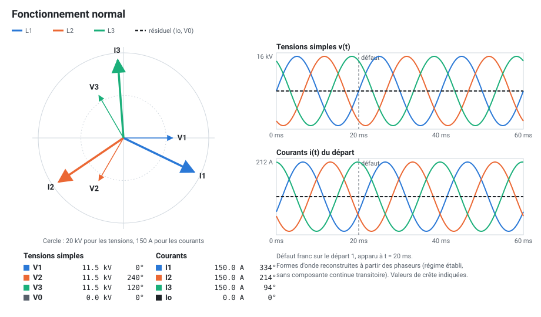
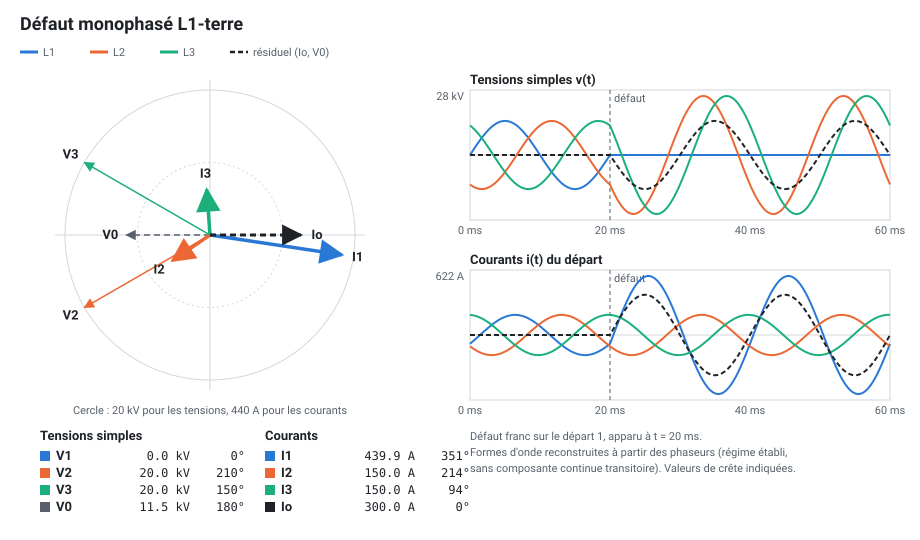
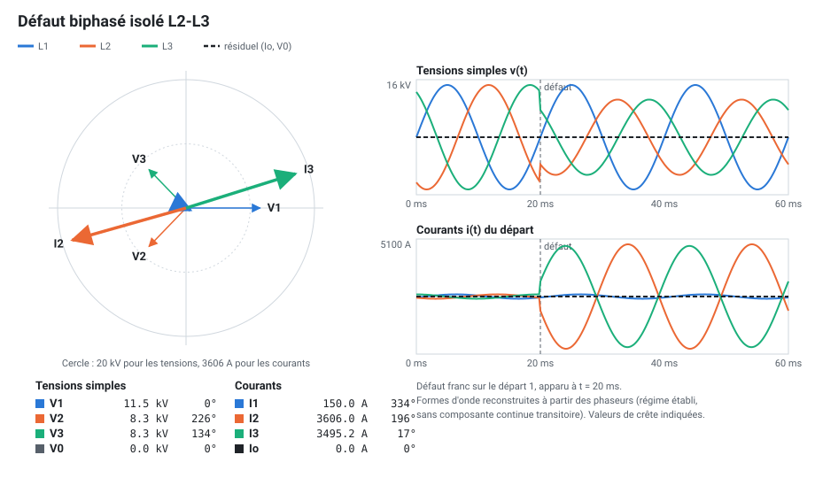
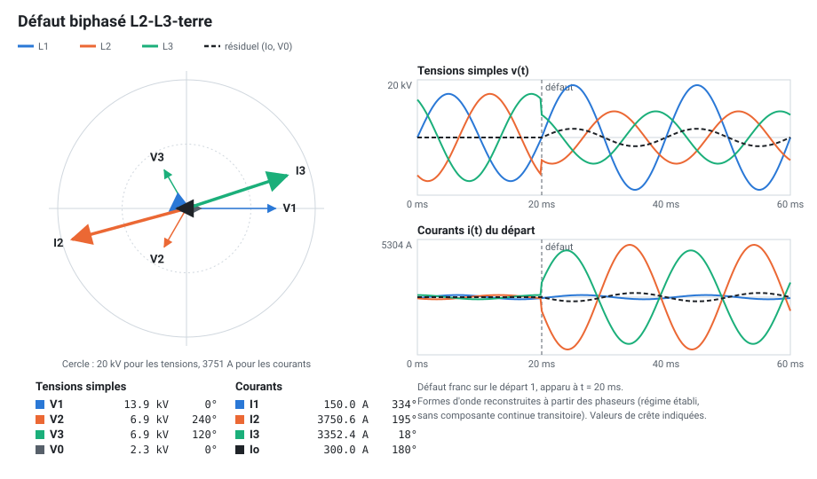
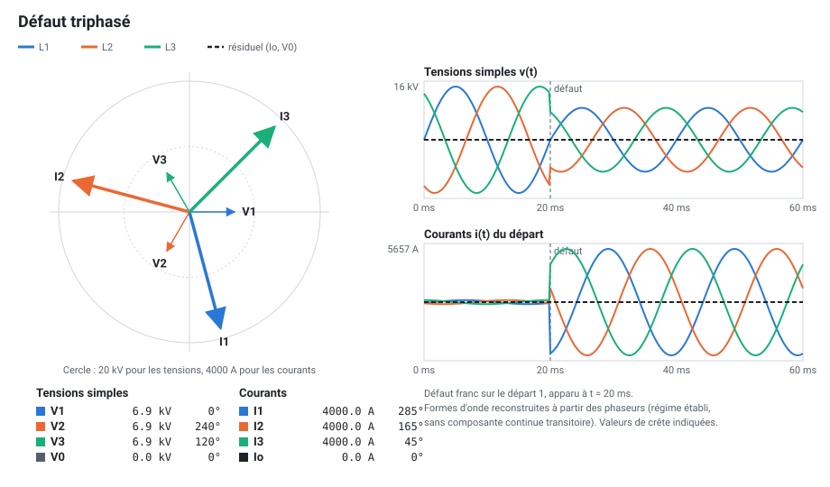

# Courants de défaut et diagrammes de Fresnel

Ce document explique les défauts francs simulés, avec pour chacun son
**diagramme de Fresnel** et ses **formes d'onde**. Les figures sont
calculées directement par le modèle de simulation (`src/demirame/simulation.py`) :
elles montrent exactement ce que voit l'automate.

Pour régénérer les figures après une modification du modèle :

```bash
uv run python docs/figures/generer_figures.py
```

Dans l'IHM, la page **Fresnel et défauts** affiche les mêmes diagrammes en
temps réel pour l'arrivée ou un départ, et les fiches théoriques ci-dessous.

## Rappels

**Phaseur.** Une grandeur sinusoïdale `x(t) = √2 · X · sin(ωt + φ)` est
représentée par un vecteur de longueur `X` (valeur efficace) et d'angle `φ`.
Dans le code, un phaseur est un **nombre complexe** Python :
`cmath.rect(X, φ)`.

**Système direct.** V1 à 0°, V2 à −120° (= 240°), V3 à +120°.
Tension simple 20 kV / √3 = **11,55 kV**, tension composée **20 kV**.

**Grandeurs résiduelles.**

| Grandeur | Définition | Rôle |
|---|---|---|
| Courant résiduel | **Io = I1 + I2 + I3** (somme vectorielle) | Nul si le système est équilibré ; révèle un courant qui retourne par la terre |
| Tension résiduelle | **V0 = (V1 + V2 + V3) / 3** | Déplacement du point neutre |

**Hypothèses du modèle** (défaut franc, en régime établi) :

| Paramètre | Valeur |
|---|---|
| Courant de charge | 150 / 250 / 200 A selon le départ, cos φ = 0,9 (retard 26°) |
| Court-circuit triphasé | **Icc3 = 4000 A**, en retard de 75° sur la tension (réseau inductif) |
| Court-circuit biphasé | **Icc2 = √3/2 × Icc3 ≈ 3464 A** |
| Défaut à la terre | Neutre mis à la terre par une résistance : **300 A**, en phase avec la tension qui le crée |
| Creux de tension au jeu de barres | 40 % de la chute du point de défaut (court-circuits entre phases) |

Les formes d'onde sont reconstruites à partir des phaseurs : elles ne
montrent pas la composante continue transitoire qui apparaît dans la
réalité au premier instant d'un court-circuit.

## Fonctionnement normal



Les trois courants de charge ont le même module et sont décalés de 120° :
leur somme est nulle, **Io ≈ 0**. Aucune protection ne démarre.

## Défaut monophasé à la terre (L1-terre)



- La phase L1 est reliée à la terre : **V1 → 0**.
- Le neutre du réseau, relié à la terre par une résistance, se **décale** de
  −V1 : **V0 = −V1** (11,55 kV à 180°).
- V2 et V3 prennent la valeur de la tension composée : **20 kV**.
- Le courant de défaut est limité par la résistance de neutre :
  **Io = V / R<sub>N</sub> ≈ 300 A**, en phase avec V1, donc **en opposition avec V0**.
  Cette relation est la base des protections directionnelles de terre.
- Le courant de L1 ne monte qu'à environ 440 A, sous le seuil I> de 800 A.
  **Seule la protection Io> (51N) détecte ce défaut.**
- La tension composée est inchangée : les clients ne voient pas de creux.

## Défaut biphasé isolé (L2-L3)



- L2 et L3 sont en court-circuit entre elles, sans contact avec la terre.
- Le courant de défaut circule de L2 vers L3 : il est poussé par la tension
  composée U23 et vaut **Icc2 = √3/2 × Icc3 ≈ 3460 A**.
- Les courants de défaut sont **opposés** (I3 ≈ −I2) : ils s'annulent dans la
  somme, donc **Io ≈ 0** et **V0 ≈ 0**.
- Au point de défaut, V2 = V3 : au jeu de barres, ces deux tensions se
  rapprochent et diminuent (creux de tension).
- **La protection I> (51)** déclenche.

## Défaut biphasé à la terre (L2-L3-terre)



- Comme le biphasé isolé, avec en plus un courant vers la terre de 300 A,
  partagé entre L2 et L3.
- **Io ≈ 300 A et V0 apparaissent**, en opposition, comme pour le défaut
  monophasé.
- **Les deux protections démarrent** (I> et Io>) : c'est la temporisation la
  plus courte qui déclenche.

## Défaut triphasé



- Les trois phases sont en court-circuit : défaut **symétrique**.
- Trois courants égaux **Icc3 = U / (√3 · Zcc) = 4000 A**, en retard de 75°
  sur leur tension simple (≈ 4060 A mesurés : la charge s'ajoute).
- Le système reste équilibré : **Io = 0, V0 = 0**.
- Creux de tension équilibré : les tensions tombent à 60 % au jeu de barres.
- **La protection I> (51)** déclenche.

## Synthèse

| Défaut | Courants de phase | Io | V0 | Protection |
|---|---|---|---|---|
| Monophasé terre | faibles (charge + 300 A sur la phase) | 300 A | 11,5 kV | Io> seule |
| Biphasé isolé | ≈ 3460 A sur 2 phases, opposés | 0 | 0 | I> |
| Biphasé terre | ≈ 3460 A sur 2 phases | 300 A | 2,3 kV | I> et Io> |
| Triphasé | ≈ 4000 A sur les 3 phases (Icc3 + charge) | 0 | 0 | I> |

À retenir :
- **I>** voit les courts-circuits entre phases, car les courants sont très forts.
- **Io>** voit tout ce qui passe par la terre, même un courant faible.
- Un défaut à la terre sur un réseau à neutre résistif donne un courant trop
  faible pour I> : c'est pour cela que chaque départ a les deux protections.
